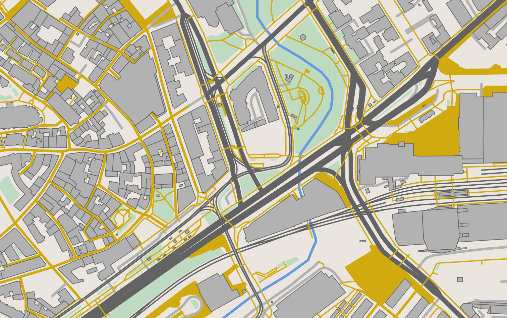
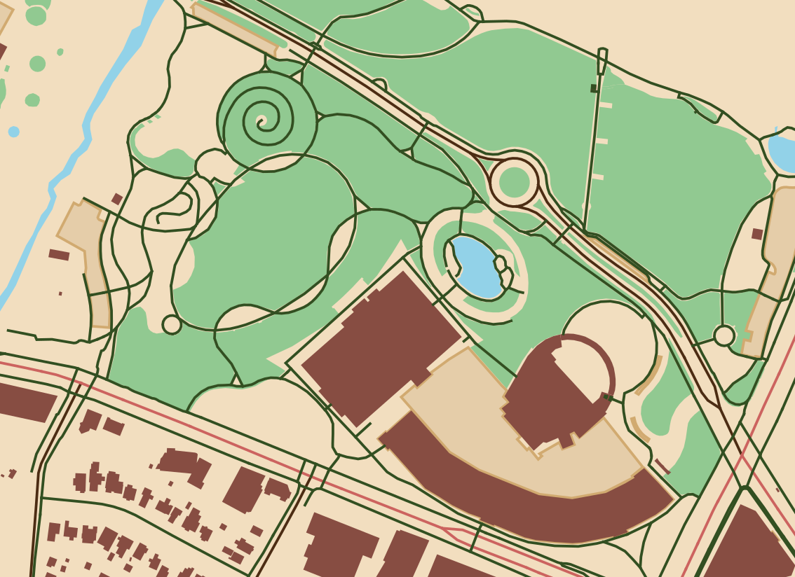
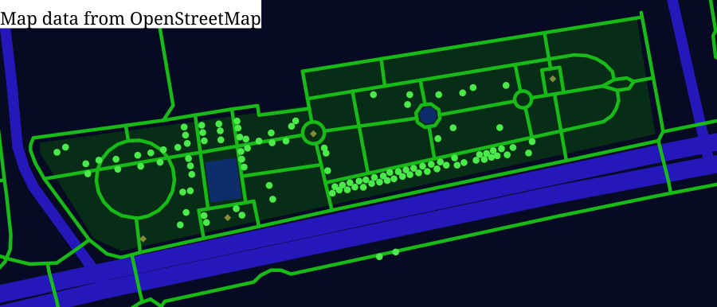

<details>
<summary>View the style file that produced the map above</summary>

```xml
<?xml version="1.0" encoding="UTF-8"?>
<style>
    <setting k="background-color" v="#eae6df"/>

    <selectors>
        <way id="building">
            <tag k="building" v=""/>
        </way>
        <way id="primary">
            <tag k="highway" v="primary"/>
        </way>
        <way id="secondary">
            <tag k="highway" v="secondary"/>
        </way>
        <way id="tertiary">
            <tag k="highway" v="tertiary"/>
        </way>
        <way id="pedestrian">
            <tag k="highway" v="pedestrian"/>
        </way>
        <way id="pedestrian_area">
            <tag k="highway" v="pedestrian"/>
            <tag k="area" v="yes"/>
        </way>
        <way id="living_street">
            <tag k="highway" v="living_street"/>
        </way>
        <way id="tram">
            <tag k="railway" v="tram"/>
        </way>
        <way id="rail">
            <tag k="railway" v="rail"/>
        </way>
        <way id="footway">
            <tag k="highway" v="footway"/>
        </way>
        <way id="path">
            <tag k="highway" v="path"/>
        </way>
        <way id="service">
            <tag k="highway" v="service"/>
        </way>
        <way id="residential">
            <tag k="highway" v="residential"/>
        </way>
        <way id="steps">
            <tag k="highway" v="steps"/>
        </way>
        <way id="park">
            <tag k="leisure" v="park"/>
        </way>
        <way id="canal">
            <tag k="waterway" v="canal"/>
        </way>
        <way id="grass">
            <tag k="landuse" v="grass"/>
        </way>
    </selectors>

    <layers>
        <polyline ref="park" fill="#bedbc1"/>
        <polyline ref="grass" fill="#bedbc1"/>
        <polyline ref="canal" stroke="#689bdd" thickness="2"/>
        <polyline ref="rail" stroke="#636363" thickness="1"/>
        <polyline ref="pedestrian" stroke="#d1aa10" thickness="2"/>
        <polyline ref="living_street" stroke="#d1aa10" thickness="2"/>
        <polyline ref="residential" stroke="#b2b2b2" thickness="2"/>
        <polyline ref="service" stroke="#b2b2b2" thickness="2"/>
        <polyline ref="tertiary" stroke="#636363" thickness="3.5"/>
        <polyline ref="secondary" stroke="#636363" thickness="4"/>
        <polyline ref="primary" stroke="#636363" thickness="5"/>
        <polyline ref="pedestrian_area" fill="#d1aa10" thickness="3"/>
        <polyline ref="tram" stroke="#636363" thickness="1"/>
        <polyline ref="footway" stroke="#d1aa10" thickness="1"/>
        <polyline ref="steps" stroke="#d1aa10" thickness="1"/>
        <polyline ref="path" stroke="#d1aa10" thickness="1"/>
        <polyline ref="building" fill="#b2b2b2" stroke="#636363" thickness="0.5"/>
    </layers>
</style>
```

</details>

# FreePaperMaps

A Java program to generate paper maps based on OSM data. Inspired by
Mapnik. Lightweight. Built from the ground up.

This project is a work in progress. Breaking changes in every commit!

**Map data in example maps is from [OpenStreetMap](https://www.openstreetmap.org/copyright/) and is
licensed under the Open Database License.**

## Features

- Parses OSM data
- Renders map to SVG
- Supports styling by querying tags
- Support for specifying dimensions/scale

## Downloading

Currently, FreePaperMaps is distributed as a JAR file. Go to https://github.com/mrmaxguns/FreePaperMaps/packages/ and
find the latest version. On the right side you will find links to download the JAR file. **Make sure you download the
JAR file that has `with-dependencies` in the filename.**

## Usage

The easiest way to download OSM map data is to go to https://openstreetmap.org and use the export feature. After selecting
the area you wish to download, you will be able to download it in OSM format.

Next, create an XML style file. As this is a new project, the style format has not yet been documented, but examples
are provided on this README.

Finally, run FreePaperMaps with `java -jar FILE` (replace FILE with the actual JAR filename). You can use
`java -jar FILE --help` to get a list of all supported options. Here is an exacmple of how I normally compile maps:

```bash
java -jar freepapermaps.jar -o map.svg -W 8in -s style.xml map.osm 
```

In the example above we created a map at `map.svg` whose width is 8 inches, using the style found in `style.xml` and
the data in `map.osm`.

## Example style file and output



<details>
<summary>View the style file that produced the map</summary>

```xml
<?xml version="1.0" encoding="UTF-8"?>
<style>
    <setting k="background-color" v="#f2debf"/>

    <selectors>
        <way id="building">
            <tag k="building" v=""/>
        </way>
        <way id="grass">
            <tag k="landuse" v="grass"/>
        </way>
        <way id="water">
            <tag k="natural" v="water"/>
        </way>
        <way id="living_street">
            <tag k="highway" v="living_street"/>
        </way>
        <way id="tertiary">
            <tag k="highway" v="tertiary"/>
        </way>
        <way id="secondary">
            <tag k="highway" v="secondary"/>
        </way>
        <way id="primary">
            <tag k="highway" v="primary"/>
        </way>
        <way id="path">
            <tag k="highway" v="path"/>
        </way>
        <way id="footway">
            <tag k="highway" v="footway"/>
        </way>
        <way id="cycleway">
            <tag k="highway" v="cycleway"/>
        </way>
        <way id="parking">
            <tag k="amenity" v="parking"/>
        </way>
    </selectors>

    <layers>
        <polyline ref="grass" fill="#91c991"/>
        <polyline ref="water" fill="#92d2e8"/>
        <polyline ref="parking" fill="#e5cda9" stroke="#d1aa70"/>
        <polyline ref="building" fill="#874d42"/>
        <polyline ref="living_street" stroke="#4c2c13"/>
        <polyline ref="tertiary" stroke="#4c2c13"/>
        <polyline ref="secondary" stroke="#4c2c13"/>
        <polyline ref="primary" stroke="#cc635f"/>
        <polyline ref="footway" stroke="#324f21"/>
        <polyline ref="path" stroke="#324f21"/>
        <polyline ref="cycleway" stroke="#324f21"/>
    </layers>
</style>
```

</details>



<details>
<summary>View the style file that produced the map</summary>

```xml
<?xml version="1.0" encoding="UTF-8"?>
<style>
    <setting k="background-color" v="#070a23"/>

    <selectors>
      <way id="park"><tag k="leisure" v="park"/></way>
      <way id="water"><tag k="natural" v="water"/></way>
      <way id="secondary"><tag k="highway" v="secondary"/></way>
      <way id="highway"><tag k="highway" v="trunk"/></way>
      <way id="footway"><tag k="highway" v="footway"/></way>
      <node id="tree"><tag k="natural" v="tree"/></node>
      <node id="artwork"><tag k="tourism" v="artwork"/></node>
      <node id="memorial"><tag k="historic" v="memorial"/></node>
    </selectors>
      
    <layers>
      <polyline ref="park" fill="#082d17"/>
      <polyline ref="water" fill="#0d2d6d"/>
      <polyline ref="secondary" stroke="#2518ba" thickness="3"/>
      <polyline ref="highway" stroke="#2518ba" thickness="5"/>
      <polyline ref="footway" stroke="#18ba18" thickness="1"/>
      <nodeshape ref="tree" fill="#4bea4b" angle="0" radius="1" vertices="10"/>
      <nodeshape ref="artwork" fill="#828c38" angle="0" radius="1" vertices="4"/>
      <nodeshape ref="memorial" fill="#828c38" angle="0" radius="1" vertices="4"/>
    </layers>
</style>
```

</details>

## Roadmap

- More comprehensive tests
- Allow processing OSM data from Overpass queries
- Arbitrary projections with `proj`
- SVG icons for nodes/ways
- Text/label support
- AND/OR in queries
- Multipolygon support
- Relation support
- Different styling by zoom level
- Geometry simplification
- Data download informed by the style sheet
- Layering support with `layer` tag
